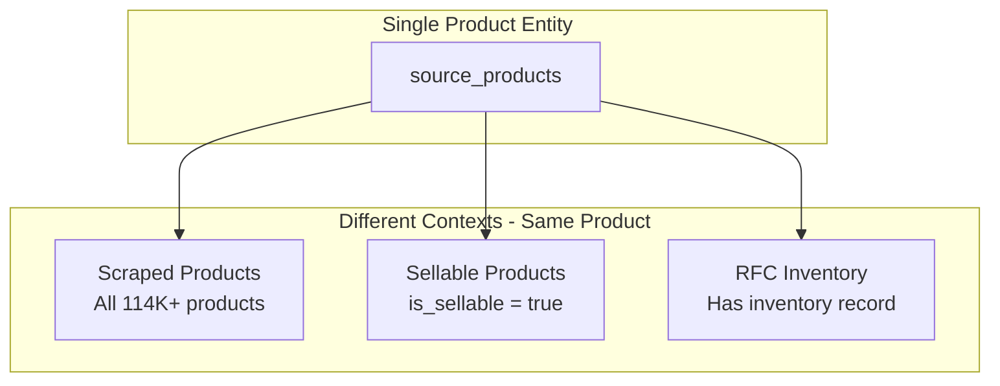
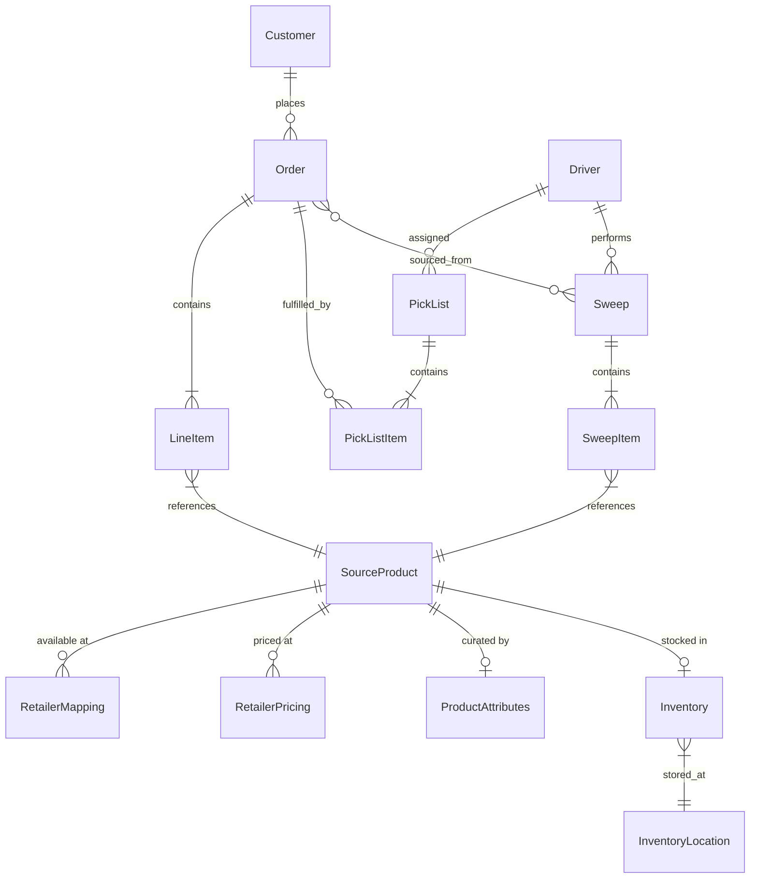

# Data Model

This document describes the key entities in Switchyard and how they relate to each other.

## Single Product Entity Architecture

Switchyard uses a **single product entity** that serves all purposes throughout its lifecycle. The same product record is used whether it's scraped, curated for sale, or stocked in the RFC warehouse.

### Write Separation

To protect product data integrity, scrapers and admin have different write permissions:

| Table | Scrapers | Admin |
|-------|----------|-------|
| `source_products` | Create new only | Full control |
| `goods_retailer_mapping` | Full control | Read only |
| `goods_retailer_pricing` | Full control | Read only |
| `goods_product_attributes` | Never | Full control |
| `inventory` | Never | Full control |

**Key principle:** Once a product exists, scrapers only update retailer-specific tables (pricing, availability), never core product attributes.

## Entity Relationship Diagram

## Product Domain

### SourceProduct

The master product record, scraped from retailers. This is the single source of truth for product identity.

| Field | Type | Description |
|-------|------|-------------|
| id | uuid | Unique identifier |
| name | string | Product name |
| barcode | string | UPC/EAN barcode (primary key for matching) |
| brand | string | Brand name |
| image_url | string | Primary product image |
| size | string | Package size (e.g., "16 oz") |
| size_uom | string | Unit of measure (oz, lb, ct) |
| category_id | uuid | Reference to Category |
| subcategory_id | uuid | Reference to subcategory |
| description | text | Product description |
| created_at | datetime | First scraped |
| updated_at | datetime | Last updated |

**Key behavior:**
- Barcode is the canonical identifier for matching across retailers
- Core attributes are set on first scrape and rarely change
- Updates to name/brand only happen if product doesn't exist

### RetailerMapping (goods_retailer_mapping)

Links a product to a specific retailer and store location. Updated by scrapers on each run.

| Field | Type | Description |
|-------|------|-------------|
| id | uuid | Unique identifier |
| product_id | uuid | Reference to SourceProduct |
| store_name | string | Retailer (heb, walmart, target, etc.) |
| retailer_location_id | string | Specific store ID |
| store_item_id | string | Retailer's internal SKU |
| store_item_name | string | Retailer's product name |
| store_location | string | Aisle location (e.g., "A12") |
| is_active | boolean | Currently available |
| last_seen_at | datetime | Last successful scrape |
| out_of_stock_count | integer | Consecutive days unavailable |

**Unique constraint:** `(product_id, store_name, retailer_location_id, store_item_id)`

### RetailerPricing (goods_retailer_pricing)

Price history for products at each retailer. New records are inserted (not updated) to maintain history.

| Field | Type | Description |
|-------|------|-------------|
| id | uuid | Unique identifier |
| product_id | uuid | Reference to SourceProduct |
| store_name | string | Retailer |
| retailer_location_id | string | Specific store ID |
| price | decimal | Current effective price |
| list_price | decimal | Regular price |
| sale_price | decimal | Sale price (if on sale) |
| is_on_sale | boolean | Currently on sale |
| price_per_unit | decimal | Unit price |
| price_per_unit_uom | string | Unit (oz, lb, each) |
| effective_from | datetime | When this price started |
| effective_to | datetime | When this price ended (null = current) |

### ProductAttributes (goods_product_attributes)

Admin-controlled curation decisions. Determines if a product is sellable and its Goods-specific settings.

| Field | Type | Description |
|-------|------|-------------|
| id | uuid | Unique identifier |
| product_id | uuid | Reference to SourceProduct |
| is_sellable | boolean | Admin decision: do we sell this? |
| curation_status | enum | pending, approved, rejected |
| selling_price | decimal | Our price to customers |
| margin_target | decimal | Target margin percentage |
| warehouse_zone | string | RFC zone (A=Ambient, C=Chilled, F=Frozen) |
| warehouse_aisle | integer | RFC aisle number |
| preferred_retailer | string | Preferred sourcing retailer |
| curated_at | datetime | When admin made decision |
| curated_by | uuid | Reference to User |

## Customer Domain

### Customer

Represents a user of the Goods mobile app.

| Field | Type | Description |
|-------|------|-------------|
| id | string | Unique identifier |
| email | string | Email address |
| first_name | string | First name |
| last_name | string | Last name |
| phone | string | Phone number |
| addresses | Address[] | Delivery/billing addresses |

**Relationships:**
- Has many Orders
- Managed via Supabase Auth

## Order Domain

### Order

A customer's purchase request.

| Field | Type | Description |
|-------|------|-------------|
| id | string | Unique identifier |
| customer_id | string | Reference to Customer |
| status | enum | Order status (see Order Flow) |
| items | LineItem[] | Products ordered |
| created_at | datetime | When order was placed |
| fulfillment_type | enum | rfc_only, sweep_only, hybrid |

**Statuses:**
`pending` → `processing` → `sweep_in_progress` → `intake` → `picking` → `staged` → `delivering` → `delivered`

### LineItem

Individual product in an order. Can be sourced from RFC inventory or via sweep.

| Field | Type | Description |
|-------|------|-------------|
| id | string | Unique identifier |
| order_id | string | Reference to Order |
| product_id | string | Reference to SourceProduct |
| quantity | number | Quantity ordered |
| unit_price | number | Price per unit |
| source | enum | rfc, sweep |
| retailer | string | Which retailer (if sweep sourced) |
| retailer_location | string | Aisle info for sweep driver |

**Sourcing logic:**
1. Check RFC inventory first
2. If insufficient quantity, split between RFC and sweep
3. Sweep items include retailer aisle location for driver

## Inventory Domain

### Inventory

Tracks RFC warehouse stock levels.

| Field | Type | Description |
|-------|------|-------------|
| id | uuid | Unique identifier |
| product_id | uuid | Reference to SourceProduct |
| location_id | uuid | Reference to InventoryLocation |
| quantity | integer | Total quantity |
| reserved_quantity | integer | Reserved for orders |
| available_quantity | integer | Generated: quantity - reserved |
| last_counted_at | datetime | Last physical count |

### InventoryLocation

Physical location within the RFC warehouse.

| Field | Type | Description |
|-------|------|-------------|
| id | uuid | Unique identifier |
| zone | string | Zone letter (A, B, C) |
| shelf | string | Shelf code (A1, A2) |
| bin | string | Bin code (A1-B3) |
| is_active | boolean | Currently in use |

### InventoryGroup

Hierarchical warehouse organization (custom module).

| Field | Type | Description |
|-------|------|-------------|
| id | string | Unique identifier |
| name | string | Group name |
| code | string | Location code (e.g., A1-2-3-1) |
| type | enum | zone, aisle, bay, shelf, slot |
| parent_id | string | Parent group reference |
| stock_location_id | string | Reference to StockLocation |

**Hierarchy:**
Zone → Aisle → Bay → Shelf → Slot

**Example:** `A1-2-3-1` = Zone A, Aisle 1, Bay 2, Shelf 3, Slot 1

## Operations Domain

### Driver

Person who performs sweeps and deliveries.

| Field | Type | Description |
|-------|------|-------------|
| id | string | Unique identifier |
| first_name | string | First name |
| last_name | string | Last name |
| phone | string | Phone number |
| email | string | Email (optional) |
| license_number | string | Driver's license |
| vehicle_info | string | Vehicle description |
| is_active | boolean | Currently active |

### Sweep

Daily shopping trip to a retailer.

| Field | Type | Description |
|-------|------|-------------|
| id | string | Unique identifier |
| store_id | string | Reference to StockLocation (retailer) |
| sweep_date | date | Date of sweep |
| scheduled_start_time | datetime | When sweep should begin |
| actual_start_time | datetime | When driver started |
| actual_end_time | datetime | When driver returned |
| driver_id | string | Reference to Driver |
| status | enum | scheduled, in_progress, completed, cancelled |
| total_items | number | Total items on manifest |

**Schedule:**
- One sweep per retailer per day (default)
- Additional sweeps can be added manually

### SweepItem

Item on a sweep manifest. Includes retailer aisle location for efficient shopping.

| Field | Type | Description |
|-------|------|-------------|
| id | string | Unique identifier |
| sweep_id | string | Reference to Sweep |
| product_id | string | Reference to SourceProduct |
| quantity | number | Quantity to pick |
| picked_quantity | number | Quantity actually picked |
| status | enum | pending, picked, substituted, unavailable |
| retailer_location | string | Aisle location from RetailerMapping |
| substitute_product_id | string | If substituted, the replacement |

### PickList

Assignment of picking work to a warehouse picker.

| Field | Type | Description |
|-------|------|-------------|
| id | string | Unique identifier |
| order_id | string | Reference to Order |
| picker_id | string | Reference to Driver (who picks) |
| status | enum | pending, in_progress, completed |
| started_at | datetime | When picking started |
| completed_at | datetime | When picking finished |

### PickListItem

Individual item to pick from warehouse.

| Field | Type | Description |
|-------|------|-------------|
| id | string | Unique identifier |
| pick_list_id | string | Reference to PickList |
| order_item_id | string | Reference to LineItem |
| product_id | string | Reference to SourceProduct |
| location_id | string | Reference to InventoryGroup (slot) |
| quantity | number | Quantity to pick |
| picked_quantity | number | Quantity picked |
| status | enum | pending, picked, unavailable |
| sequence | number | Order in pick path |

## User Domain

### User

Admin/staff user of Switchyard.

| Field | Type | Description |
|-------|------|-------------|
| id | string | Unique identifier |
| email | string | Email address |
| first_name | string | First name |
| last_name | string | Last name |
| role | enum | admin, manager, picker, driver |

**Roles:**
- `admin` - Full access
- `manager` - Operations management
- `picker` - Warehouse picking
- `driver` - Sweep operations

## Dashboard Views

The admin dashboard has three main product-related pages, all querying the same underlying data:

| Page | Filter | Primary Use |
|------|--------|-------------|
| **Scraped Products** | All `source_products` | Monitor prices, availability, discover products |
| **Products** | `goods_product_attributes.is_sellable = true` | Manage sellable catalog |
| **Inventory** | Has `inventory` record | Manage RFC stock levels, trigger reorders |

All three pages query directly from Supabase with React Query caching for performance.
