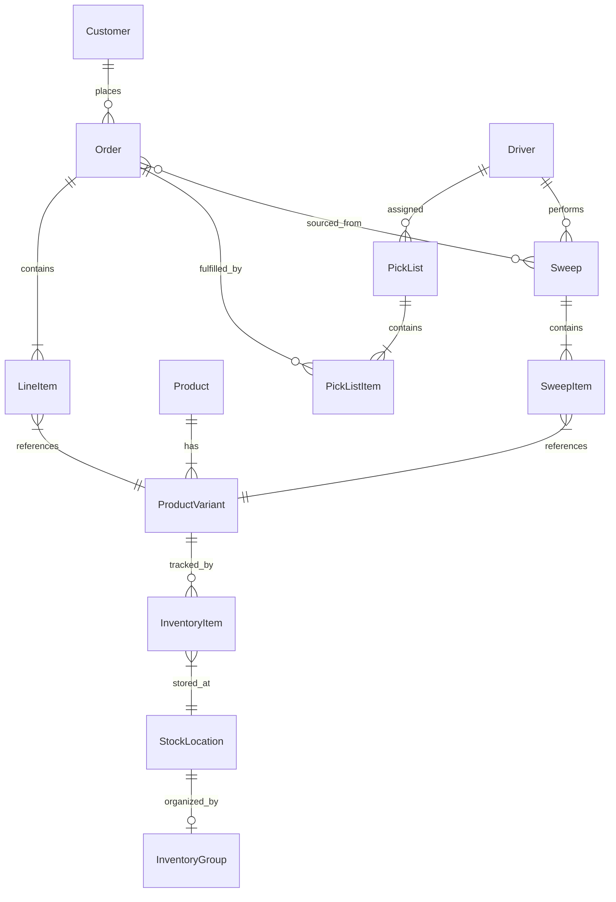

# Data Model

This document describes the key entities in Switchyard and how they relate to each other.

## Entity Relationship Diagram

## Core Entities

### Customer

Represents a user of the Goods mobile app.

| Field | Type | Description |
|-------|------|-------------|
| id | string | Unique identifier |
| email | string | Email address |
| first_name | string | First name |
| last_name | string | Last name |
| phone | string | Phone number |
| addresses | Address[] | Delivery/billing addresses |

**Relationships:**
- Has many Orders
- Managed via Supabase Auth

### Order

A customer's purchase request.

| Field | Type | Description |
|-------|------|-------------|
| id | string | Unique identifier |
| customer_id | string | Reference to Customer |
| status | enum | Order status (see Order Flow) |
| items | LineItem[] | Products ordered |
| created_at | datetime | When order was placed |
| fulfillment_type | enum | rfc_only, sweep_only, hybrid |

**Statuses:**
`pending` → `processing` → `sweep_in_progress` → `intake` → `picking` → `staged` → `delivering` → `delivered`

### LineItem

Individual product in an order.

| Field | Type | Description |
|-------|------|-------------|
| id | string | Unique identifier |
| order_id | string | Reference to Order |
| variant_id | string | Reference to ProductVariant |
| quantity | number | Quantity ordered |
| unit_price | number | Price per unit |
| source | enum | rfc, retailer |
| retailer | string | Which retailer (if sourced externally) |

### Product

A purchasable item in the catalog.

| Field | Type | Description |
|-------|------|-------------|
| id | string | Unique identifier |
| title | string | Product name |
| description | string | Product description |
| handle | string | URL-friendly slug |
| categories | Category[] | Product categories |
| variants | ProductVariant[] | Size/flavor variations |
| images | Image[] | Product images |
| metadata | object | Extended attributes |

**Metadata includes:**
- Retailer-specific IDs
- Scraping source information
- Nutritional data

### ProductVariant

A specific variation of a product (size, flavor, etc.).

| Field | Type | Description |
|-------|------|-------------|
| id | string | Unique identifier |
| product_id | string | Reference to Product |
| sku | string | Stock keeping unit |
| barcode | string | UPC/EAN barcode |
| title | string | Variant name |
| prices | Price[] | Prices at different retailers |

### Price

Price information for a variant.

| Field | Type | Description |
|-------|------|-------------|
| id | string | Unique identifier |
| variant_id | string | Reference to ProductVariant |
| amount | number | Price in cents |
| price_list_id | string | Which price list (retailer) |

**Price Lists:**
- `selling` - Our price to customers
- `heb` - Cost at HEB
- `target` - Cost at Target
- `walmart` - Cost at Walmart
- etc.

## Inventory Entities

### StockLocation

A place where inventory is stored.

| Field | Type | Description |
|-------|------|-------------|
| id | string | Unique identifier |
| name | string | Location name |
| address | object | Physical address |
| metadata | object | Extended attributes |

**Types:**
- RFC (our warehouse)
- Retailer locations (for availability tracking)

### InventoryItem

Tracks stock of a variant at a location.

| Field | Type | Description |
|-------|------|-------------|
| id | string | Unique identifier |
| sku | string | SKU reference |
| location_id | string | Reference to StockLocation |
| stocked_quantity | number | Total quantity |
| reserved_quantity | number | Reserved for orders |

### InventoryGroup

Hierarchical warehouse organization (custom module).

| Field | Type | Description |
|-------|------|-------------|
| id | string | Unique identifier |
| name | string | Group name |
| code | string | Location code (e.g., A1-2-3-1) |
| type | enum | zone, aisle, bay, shelf, slot |
| parent_id | string | Parent group reference |
| stock_location_id | string | Reference to StockLocation |

**Hierarchy:**
Zone → Aisle → Bay → Shelf → Slot

**Example:** `A1-2-3-1` = Zone A, Aisle 1, Bay 2, Shelf 3, Slot 1

## Operations Entities

### Driver

Person who performs sweeps and deliveries.

| Field | Type | Description |
|-------|------|-------------|
| id | string | Unique identifier |
| first_name | string | First name |
| last_name | string | Last name |
| phone | string | Phone number |
| email | string | Email (optional) |
| license_number | string | Driver's license |
| vehicle_info | string | Vehicle description |
| is_active | boolean | Currently active |
| customer_id | string | Optional link to Customer |

### Sweep

Daily shopping trip to a retailer.

| Field | Type | Description |
|-------|------|-------------|
| id | string | Unique identifier |
| store_id | string | Reference to StockLocation (retailer) |
| sweep_date | date | Date of sweep |
| scheduled_start_time | datetime | When sweep should begin |
| actual_start_time | datetime | When driver started |
| actual_end_time | datetime | When driver returned |
| driver_id | string | Reference to Driver |
| status | enum | scheduled, in_progress, completed, cancelled |
| total_items | number | Total items on manifest |

**Schedule:**
- One sweep per retailer per day (default)
- Additional sweeps can be added manually

### SweepItem

Item on a sweep manifest.

| Field | Type | Description |
|-------|------|-------------|
| id | string | Unique identifier |
| sweep_id | string | Reference to Sweep |
| variant_id | string | Reference to ProductVariant |
| quantity | number | Quantity to pick |
| picked_quantity | number | Quantity actually picked |
| status | enum | pending, picked, substituted, unavailable |
| substitute_variant_id | string | If substituted, the replacement |

### PickList

Assignment of picking work to a warehouse picker.

| Field | Type | Description |
|-------|------|-------------|
| id | string | Unique identifier |
| order_id | string | Reference to Order |
| picker_id | string | Reference to Driver (who picks) |
| status | enum | pending, in_progress, completed |
| started_at | datetime | When picking started |
| completed_at | datetime | When picking finished |

### PickListItem

Individual item to pick from warehouse.

| Field | Type | Description |
|-------|------|-------------|
| id | string | Unique identifier |
| pick_list_id | string | Reference to PickList |
| order_item_id | string | Reference to LineItem |
| product_id | string | Reference to Product |
| location_id | string | Reference to InventoryGroup (slot) |
| quantity | number | Quantity to pick |
| picked_quantity | number | Quantity picked |
| status | enum | pending, picked, unavailable |
| sequence | number | Order in pick path |

## User Entities

### User

Admin/staff user of Switchyard.

| Field | Type | Description |
|-------|------|-------------|
| id | string | Unique identifier |
| email | string | Email address |
| first_name | string | First name |
| last_name | string | Last name |
| role | enum | admin, manager, picker, driver |

**Roles:**
- `admin` - Full access
- `manager` - Operations management
- `picker` - Warehouse picking
- `driver` - Sweep operations

## Tote (Future)

Container for staged orders.

| Field | Type | Description |
|-------|------|-------------|
| id | string | Unique identifier |
| qr_code | string | QR code on tote |
| order_id | string | Reference to Order |
| status | enum | empty, staged, delivering, returned |

**Note:** Robot-tote interface is out of Switchyard scope.

