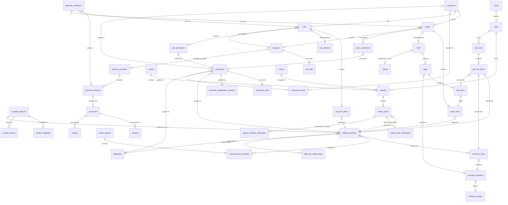
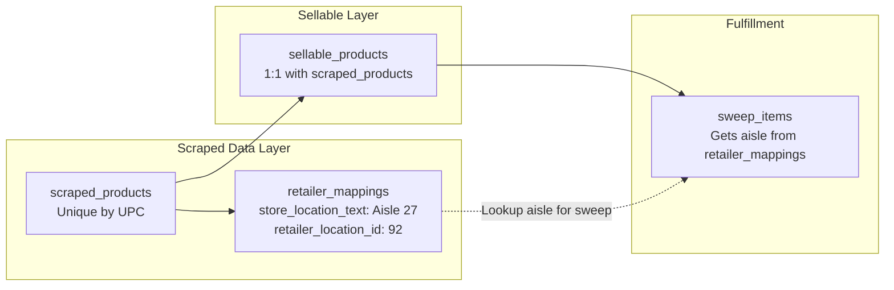

# Data Model

This document describes the key entities in Switchyard and how they relate to each other.

## Schema Architecture Overview

Switchyard uses a **layered product architecture** that separates scraped data from the curated sellable catalog:

1. **Scraped Products Layer** - Raw product data from retailer scrapers (unique by UPC)
2. **Sellable Products Layer** - Curated catalog of products we sell (1:1 with scraped products)
3. **Inventory Layer** - Physical stock in the RFC warehouse
4. **Order & Fulfillment Layer** - Customer orders, bags, totes, and robot delivery

## Complete Schema Architecture

## Write Separation

To protect product data integrity, scrapers and admin have different write permissions:

| Table | Scrapers | Admin |
|-------|----------|-------|
| `scraped_products` | Create new only | Full control |
| `retailer_mappings` | Full control | Read only |
| `retailer_pricing` | Full control | Read only |
| `sellable_products` | Never | Full control |
| `inventory_items` | Never | Full control |

<Warning>
Once a product exists, scrapers only update retailer-specific tables (pricing, availability), never core product attributes.
</Warning>

## Retailer Location Data Flow

For items NOT stocked in inventory, aisle/location data comes from `retailer_mappings`:

## Product Domain

### scraped_products

The raw product catalog from scrapers. **Unique by UPC/barcode.**

| Field | Type | Description |
|-------|------|-------------|
| id | uuid | Unique identifier |
| name | string | Product name |
| barcode | string | UPC/EAN barcode (canonical identifier) |
| brand | string | Brand name |
| image_url | string | Primary product image |
| category_id | uuid | Reference to Category |
| subcategory_id | uuid | Reference to subcategory |
| description | text | Product description |
| created_at | datetime | First scraped |
| updated_at | datetime | Last updated |

### sellable_products

The curated catalog of products we sell. **1:1 relationship with scraped_products.**

| Field | Type | Description |
|-------|------|-------------|
| id | uuid | Unique identifier |
| scraped_product_id | uuid | Reference to scraped_products (UNIQUE) |
| name | string | Curated product name |
| brand | string | Brand |
| selling_price | decimal | Our price to customers |
| is_perishable | boolean | Requires expiration tracking |
| warehouse_zone | string | RFC zone (A=Ambient, C=Chilled, F=Frozen) |
| preferred_retailer | string | Preferred sourcing retailer |
| status | enum | draft, active, discontinued |
| is_active | boolean | Currently available for sale |

### retailer_mappings

Links scraped products to specific retailers and stores. **Contains aisle/location data for sweeps.**

| Field | Type | Description |
|-------|------|-------------|
| id | uuid | Unique identifier |
| product_id | uuid | Reference to scraped_products |
| store_name | string | Retailer (heb, walmart, target) |
| retailer_location_id | string | Specific store ID |
| store_item_id | string | Retailer's internal SKU |
| store_location_text | string | Aisle location (e.g., "Aisle 27") |
| store_aisle | integer | Parsed aisle number |
| is_active | boolean | Currently available |
| last_seen_at | datetime | Last successful scrape |

### variant_groups & variant_group_members

Groups related products together for PDP display (e.g., 12oz Coke, 20oz Coke, 2L Coke).

| Field | Type | Description |
|-------|------|-------------|
| variant_group_id | uuid | Reference to variant_groups |
| sellable_product_id | uuid | Reference to sellable_products |
| is_default | boolean | Shown first on PDP |
| variant_label | string | Display label (e.g., "12 oz") |

### bulk_sku_relationships

Mathematical relationship where a bulk SKU contains N individual SKUs.

| Field | Type | Description |
|-------|------|-------------|
| bulk_sellable_id | uuid | The bulk product (e.g., 12-pack) |
| individual_sellable_id | uuid | The individual unit (e.g., single can) |
| unit_count | integer | How many individuals in the bulk |
| break_down_on_receipt | boolean | Auto-break bulk into individuals |

## Inventory Domain

### inventory_items

Tracks physical inventory in the RFC warehouse. Supports **FEFO/FIFO picking**.

| Field | Type | Description |
|-------|------|-------------|
| id | uuid | Unique identifier |
| sellable_product_id | uuid | Reference to sellable_products |
| location_id | uuid | Reference to inventory_locations |
| quantity | integer | Total quantity |
| reserved_quantity | integer | Reserved for orders |
| received_at | datetime | When received (for FIFO) |
| expiration_date | date | Expiration (for FEFO, nullable) |
| lot_number | string | Lot tracking |
| source_sweep_id | uuid | Which sweep brought this in |
| unit_cost | decimal | Acquisition cost |

<Note>
**FEFO/FIFO Picking**: Items are picked with expiring soonest first (FEFO), with oldest received as fallback for non-perishables (FIFO).
</Note>

### inventory_locations

Physical location within the RFC warehouse.

### inventory_groups

Hierarchical warehouse organization: Zone → Aisle → Bay → Shelf → Slot

## Staff Domain

### staff

Employees who can be pickers, drivers, or both. Replaces the old `drivers` table.

| Field | Type | Description |
|-------|------|-------------|
| id | uuid | Unique identifier |
| user_id | string | Link to admin user account |
| email | string | Staff email |
| is_picker | boolean | Can pick orders |
| is_driver | boolean | Can perform sweeps |
| is_active | boolean | Currently active |

<Note>
Staff members can have both picker and driver roles, but not perform both simultaneously.
</Note>

## Order & Fulfillment Domain

### orders

Customer orders from app or admin dashboard.

| Field | Type | Description |
|-------|------|-------------|
| id | uuid | Unique identifier |
| customer_id | uuid | Reference to customers |
| source | enum | 'app' or 'admin' |
| location_id | uuid | Store location for pricing/tax |
| payment_collection_id | text | Reference to payment_collection |

### order_items

Line items referencing sellable_products.

| Field | Type | Description |
|-------|------|-------------|
| sellable_product_id | uuid | Reference to sellable_products |
| fulfillment_source | enum | 'inventory' or 'sweep' |
| allocated_at | datetime | When allocation was made |

### totes, bags, bag_items

Physical containers for robot delivery:

- **Order** → has many **Totes**
- **Tote** → has many **Bags** (one robot per tote)
- **Bag** → has many **Bag Items** (temperature-separated)
- **Bag Item** → fulfills an **Order Item**

## Operations Domain

### routes

Groups multiple sweeps together for a single driver trip.

### sweeps

Shopping trips to retailers. Supports order sweeps and inventory sweeps.

| Field | Type | Description |
|-------|------|-------------|
| sweep_type | enum | 'order' or 'inventory' |
| driver_id | uuid | Reference to staff |
| route_id | uuid | Reference to routes |

### pick_lists

RFC picking assignments assigned to staff (pickers).

### sweep_inventory_allocations

Links sweep items to inventory for inventory purchasing sweeps.

## Store API Integration

### Cart Module

- `carts` → linked to customers
- `cart_line_items` → reference **sellable_products** (not Medusa product_variant)
- `cart_address` → billing address only (shipping is static store address)

### Promotions Module

- `promotions` → can target sellable_products, categories, customers, or customer_groups
- `order_promotions` / `cart_promotions` → track applied promotions

### Payments Module (Full Medusa Flow)

- `payment_collections` → container for payment attempts
- `payment_sessions` → individual payment attempts with a provider
- `payments` → successful payments with captures/refunds

### Locations & Tax Module

- `locations` → physical store locations with location-specific pricing
- `location_tax_rates` → tax rates per location
- Carts and orders reference their location for pricing and tax calculation

## Dashboard Views

The admin dashboard queries directly from Supabase with React Query caching:

| Page | Table | Primary Use |
|------|-------|-------------|
| **Scraped Products** | `scraped_products` | Monitor prices, availability, discover products |
| **Sellable Products** | `sellable_products` | Manage curated catalog |
| **Inventory** | `inventory_items` | Manage RFC stock levels, FEFO/FIFO |
| **Staff** | `staff` | Manage pickers and drivers |
