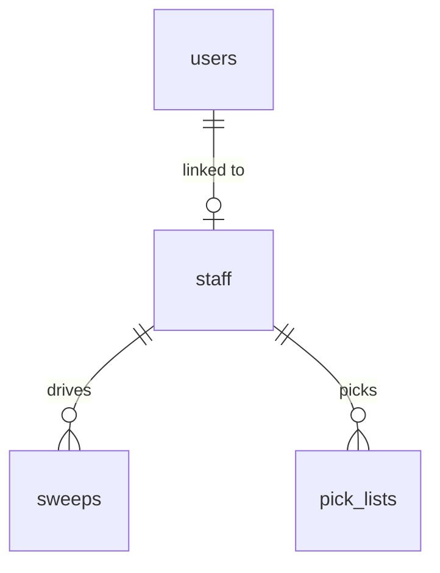
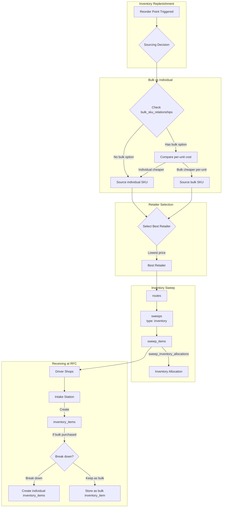

# Fulfillment Architecture

This document describes how orders are allocated, picked, and delivered in Switchyard.

## Overview

Switchyard uses a hybrid fulfillment model:

| Source | When Used | Flow |
|--------|-----------|------|
| **RFC Inventory** | Items in stock at warehouse | `inventory_items` → `pick_list` → `bag` → `tote` → `robot` |
| **Retail Sweep** | Items not in stock | `sweep_items` → driver shops → intake → `bag` → `tote` → `robot` |

The allocation engine automatically decides which source to use based on inventory availability and economics.

## Staff and Roles



The `staff` table manages employees who can be pickers, drivers, or both:

| Field | Description |
|-------|-------------|
| `is_picker` | Can pick orders from RFC inventory |
| `is_driver` | Can perform sweeps at retailers |
| `user_id` | Optional link to admin user account |

<Note>
Staff members can have both roles, but cannot perform both simultaneously. Each pick_list is assigned to a picker, and each sweep is assigned to a driver.
</Note>

## Order Allocation

When an order is placed, the allocation engine decides how each item will be fulfilled:

### Allocation Logic

1. **Check RFC Inventory** (FEFO/FIFO order)
   - If sufficient stock exists → allocate to `pick_list`
   - Set `fulfillment_source = 'inventory'`

2. **Fallback to Sweep**
   - If insufficient/no inventory → allocate to `sweep`
   - Set `fulfillment_source = 'sweep'`
   - Select best retailer based on price

### Database Function: allocate_order_item

```sql
-- Allocate an order item to inventory or sweep
SELECT * FROM allocate_order_item(
    p_order_item_id := 'order-item-uuid',
    p_sellable_product_id := 'sellable-uuid',
    p_quantity := 2
);
-- Returns: allocation_type, available_quantity, inventory_item_id
```

## Inventory Purchasing Flow

The system can automatically source inventory from retailers, considering bulk vs individual pricing:



### Retailer Selection Function

```sql
-- Get best retailer for a sellable product (considers bulk pricing)
SELECT * FROM get_best_retailer('sellable-product-uuid');
-- Returns: sellable_id, store_name, unit_price, units_per_purchase, price_per_unit, source_type
```

## Sweep Types

| Type | Purpose | Allocation Table |
|------|---------|------------------|
| `order` | Fulfill customer orders | `sweep_order_allocations` |
| `inventory` | Restock RFC inventory | `sweep_inventory_allocations` |

## Routes and Sweeps

### Routes

Routes group multiple sweeps for a single driver trip:

| Field | Description |
|-------|-------------|
| `route_date` | Date of the route |
| `driver_id` | Staff member (driver role) |
| `status` | scheduled, in_progress, completed |

### Sweeps

Each sweep is a shopping trip to one retailer:

| Field | Description |
|-------|-------------|
| `route_id` | Parent route (optional) |
| `store_id` | Retailer store |
| `sweep_type` | 'order' or 'inventory' |
| `driver_id` | Staff member (driver role) |

### Sweep Items

Items on the sweep manifest include retailer aisle location:

| Field | Description |
|-------|-------------|
| `sellable_product_id` | What to buy |
| `quantity` | How many to buy |
| `store_location_text` | Aisle location from retailer_mappings |
| `store_aisle` | Parsed aisle number |
| `unit_price` | Expected price |
| `actual_price` | Price driver paid |

## Pick Lists

RFC picking assignments for warehouse pickers:

| Field | Description |
|-------|-------------|
| `order_id` | Order being picked |
| `picker_id` | Staff member (picker role) |
| `status` | pending, in_progress, completed |

### Pick List Items

Each item includes the specific inventory item to pick (FEFO/FIFO):

| Field | Description |
|-------|-------------|
| `sellable_product_id` | What to pick |
| `inventory_item_id` | Specific inventory item (FEFO/FIFO) |
| `quantity` | How many to pick |
| `bag_item_id` | Created when scanned into bag |

## Bags, Totes, and Robot Delivery

### Assembly Flow

1. **Picking Path**: Picker scans items into bags from `inventory_items`
2. **Intake Path**: Intake staff scans sweep items into bags
3. **Bags**: Temperature-separated (ambient, chilled, frozen)
4. **Totes**: One order → multiple totes → multiple bags each
5. **Robots**: One robot per tote (1:1 relationship)

### Entity Relationships

| Entity | Contains | Relationship |
|--------|----------|--------------|
| Order | Totes | One-to-many |
| Tote | Bags | One-to-many |
| Bag | Bag Items | One-to-many |
| Bag Item | Order Item | Fulfills |

### Temperature Zones

| Bag Type | Contents |
|----------|----------|
| `ambient` | Room temperature items |
| `chilled` | Refrigerated items |
| `frozen` | Frozen items |

## FEFO/FIFO Picking

When selecting inventory items to pick:

```sql
-- Pick oldest expiring first, then oldest received for non-perishables
SELECT * FROM pick_inventory_fefo_fifo(
    p_sellable_product_id := 'sellable-uuid',
    p_quantity := 2
);
-- Returns: inventory_item_id, available_quantity, expiration_date, received_at, location_id
```

<Warning>
Always use the FEFO/FIFO functions to select inventory. Never pick items randomly - this ensures proper rotation and reduces waste.
</Warning>

## System Interaction Summary

| System | Reads From | Writes To |
|--------|------------|-----------|
| **Scrapers** | - | scraped_products, retailer_mappings, retailer_pricing |
| **Admin Dashboard** | All tables | sellable_products, variant_groups, inventory_items, orders, sweeps, staff |
| **Zebra Scanners (Picking)** | sellable_products, inventory_items, pick_lists | pick_list_items, bag_items, bags |
| **Zebra Scanners (Intake)** | sweeps, sweep_items | bag_items, bags, inventory_items |
| **Store API (Frontend App)** | sellable_products, variant_groups, carts, promotions, locations | carts, cart_line_items, orders, order_items, payment_sessions |
| **Driver App** | routes, sweeps, sweep_items, retailer_mappings | sweep_items (status, picked_quantity, actual_price) |
| **Robots** | totes, orders | tote status updates |
| **Allocation Engine** | orders, inventory_items, retailer_mappings, sweeps | order_items, sweep_items, pick_list_items, sweep_order_allocations |
| **Inventory Engine** | inventory_items, retailer_pricing, bulk_sku_relationships | sweeps (type=inventory), sweep_items, sweep_inventory_allocations |
| **Payment Providers** | payment_sessions | payments, captures, refunds |


