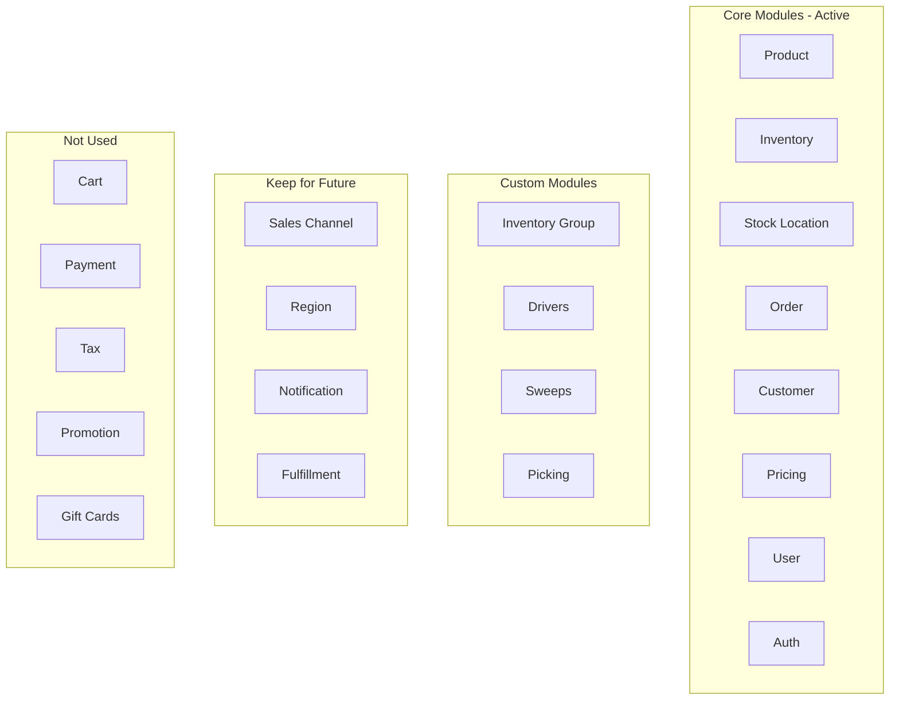
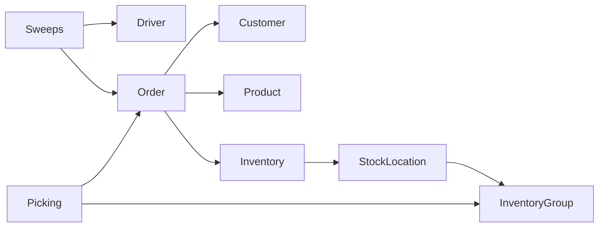

# Module Map

Switchyard uses a modular architecture. This document maps which modules we use, which are custom-built, and which are not needed for our use case.

## Module Overview

## Active Core Modules

These modules are actively used and essential to Switchyard operations.

| Module | Purpose in Switchyard | Key Features Used |
|--------|----------------------|-------------------|
| **Product** | Product catalog from retailer scraping | Products, variants, categories, images |
| **Inventory** | Stock levels at RFC and retailers | Quantity tracking, reservations |
| **Stock Location** | RFC warehouse structure | Zones, aisles, locations |
| **Order** | Customer orders from mobile app | Order creation, line items, status |
| **Customer** | Customer accounts | Profiles, addresses, order history |
| **Pricing** | Retailer costs + selling prices | Price lists, multi-price per product |
| **User** | Admin users and staff | Roles, permissions, authentication |
| **Auth** | Authentication system | Supabase integration, JWT, sessions |
| **API Key** | API authentication | Service accounts, publishable keys |

## Custom Modules

These modules are custom-built for Goods-specific functionality.

### Inventory Group
**Location:** `packages/modules/inventory-group/`

Extends stock locations with a hierarchical structure for warehouse organization.

| Entity | Description |
|--------|-------------|
| Zone | Top-level warehouse area (e.g., refrigerated, dry goods) |
| Aisle | Row within a zone |
| Bay | Section within an aisle |
| Shelf | Vertical level within a bay |
| Slot | Specific position on a shelf |

**Used by:** Picker app for efficient route navigation

### Drivers
**Location:** `packages/modules/drivers/`

Manages drivers who perform sweeps and deliveries.

| Entity | Description |
|--------|-------------|
| Driver | Person who shops at retailers, includes contact info, vehicle info |

**Used by:** Sweep assignment, driver apps

### Sweeps
**Location:** `packages/modules/sweeps/`

Daily shopping trips to retailers to fulfill orders.

| Entity | Description |
|--------|-------------|
| Sweep | Scheduled trip to a retailer |
| SweepItem | Item on the sweep manifest |

**Used by:** Order allocation, driver manifest, intake processing

### Picking
**Location:** `packages/modules/picking/`

RFC warehouse picking operations.

| Entity | Description |
|--------|-------------|
| PickList | Assignment of orders to a picker |
| PickListItem | Individual item to pick with location |

**Used by:** Picker scanner app, warehouse operations

## Modules Kept for Future

These modules are not heavily used now but will be needed as we scale.

| Module | Current Use | Future Use |
|--------|-------------|------------|
| **Sales Channel** | Single storefront | Multiple storefronts, B2B |
| **Region** | Single region (Austin) | Geographic expansion |
| **Notification** | Minimal | Customer notifications, internal alerts |
| **Fulfillment** | Not as designed | Repurpose for sweep/pick tracking |

## Modules Not Used (But Kept)

These modules are not actively used in Switchyard operations, but are kept because they are tightly integrated with core functionality. Removing them would risk breaking internal workflows.

| Module | Reason Not Used | Why Kept |
|--------|-----------------|----------|
| **Cart** | Mobile app manages cart | Required by Order module internals |
| **Payment** | Payments in mobile app via Stripe | Required by Order module internals |
| **Tax** | Simple tax calculation in app | Required by Order validation |
| **Promotion** | No promotions currently | May be used in future |
| **Gift Cards** | Not offered | Low overhead, future optionality |
| **Currency** | USD only | Region module dependency |

**Note:** These modules don't cause issues by existing. Attempting to disable them could break order creation and validation workflows. Leave them in place.

## Infrastructure Modules

These support core functionality and should be kept.

| Module | Purpose |
|--------|---------|
| **Cache (Redis)** | Performance caching |
| **Event Bus (Redis)** | Async event handling |
| **Workflow Engine** | Background job processing |
| **Locking** | Distributed locks |
| **Index** | Search indexing |
| **File** | File/image storage |

## Module Dependencies

Key dependencies to be aware of:

## Configuration

Modules are configured in `apps/goods-backend/switchyard-config.ts`. To disable a module, remove it from the modules array or set `enabled: false`.

## Adding New Modules

When adding a custom module:

1. Create module in `packages/modules/[module-name]/`
2. Include: `package.json`, `tsconfig.json`, `src/index.ts`
3. Define models in `src/models/`
4. Create service in `src/services/`
5. Add migrations in `src/migrations/`
6. Register in `switchyard-config.ts`

