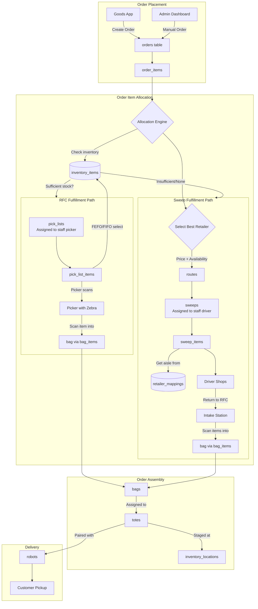
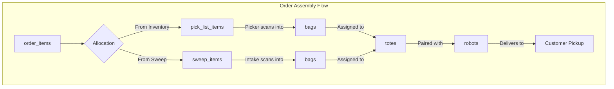

# Order Flow

This document describes the complete lifecycle of an order in the Goods/Switchyard system, from customer placement through robot delivery.

## Overview

Orders in Goods can be fulfilled from two sources:

1. **RFC (Warehouse)** - Items stocked in our fulfillment center, available for immediate picking
2. **Retailers** - Items sourced from partner retailers (HEB, Target, Walmart, Central Market, Whole Foods, Costco, Trader Joes)

The fulfillment strategy depends on product availability, pricing, and route optimization.

## Order Fulfillment Flow

## Bags, Totes, and Order Assembly

### Relationships:

- **Order** → has many **Totes** (one order may require multiple totes)
- **Tote** → has many **Bags** (bags go inside totes)
- **Bag** → has many **Bag Items** (items packed into a bag)
- **Bag Item** → links to **Order Item** (fulfills an order item)
- **Tote** → paired with **Robot** for delivery (1:1)

### Bag Types

Bags are temperature-separated:
- **ambient** - Room temperature items
- **chilled** - Refrigerated items
- **frozen** - Frozen items

## Order Statuses

| Status | Description |
|--------|-------------|
| `pending` | Order just placed, awaiting processing |
| `processing` | Being allocated to sweeps and/or RFC pick queue |
| `sweep_in_progress` | Driver is shopping at retailer(s) |
| `intake` | Items returned to RFC, being sorted |
| `picking` | RFC items being picked by warehouse staff |
| `staged` | Order assembled in tote, ready for robot |
| `delivering` | Robot en route to customer |
| `delivered` | Customer has received order |

## Staff Roles

| Role | Responsibilities |
|------|------------------|
| **Picker** | Picks items from RFC inventory, scans into bags |
| **Driver** | Performs sweeps at retailers, returns items to RFC |

<Note>
Staff members can have both picker and driver roles, but cannot perform both simultaneously. Each pick_list is assigned to a staff member with the picker role. Each sweep is assigned to a staff member with the driver role.
</Note>

## Detailed Flow

### 1. Order Placement

Customer places an order through the Goods mobile app or admin dashboard. Orders reference:
- **location_id** - Store location for pricing and tax
- **customer_id** - Customer placing the order
- **source** - 'app' or 'admin'

Order items reference **sellable_products** (not raw scraped products).

### 2. Source Analysis (Allocation Engine)

When an order arrives, the allocation engine analyzes each line item:

**Decision Factors:**
- RFC inventory availability (using FEFO/FIFO)
- Retailer pricing (we track costs at each retailer)
- Bulk vs individual SKU pricing
- Route optimization

**Sourcing Rules:**
1. Check inventory_items for available stock (FEFO/FIFO order)
2. If sufficient stock → allocate to pick_list (fulfillment_source = 'inventory')
3. If insufficient/none → allocate to sweep (fulfillment_source = 'sweep')
4. For sweeps, select best retailer based on price (including bulk SKU options)

### 3. RFC-Only Orders (Inventory Path)

Orders containing only RFC-stocked items:

1. Order items allocated to pick_list
2. Pick_list assigned to staff (picker)
3. Picker uses Zebra scanner to locate items (FEFO/FIFO order)
4. Picker scans items into bags (temperature-separated)
5. Bags assigned to totes
6. Totes staged for robot delivery

### 4. Sweep Operations

Orders requiring retailer items:

**Routes and Sweeps:**
- Routes group multiple sweeps for a driver trip
- Each sweep is for one retailer store
- Sweep type: 'order' (for customer orders) or 'inventory' (for stock replenishment)

**Sweep Manifest:**
- Aggregates items from sweep_items
- Includes aisle locations from retailer_mappings
- Driver receives manifest on their device

**During Shopping:**
- Driver shops the manifest
- Records actual_price paid
- If item is out of stock, can be pushed to another sweep or substituted

### 5. Intake Processing

When drivers return from sweeps:

1. Items scanned at intake station
2. Scanned items create bag_items linked to:
   - sweep_item_id (for tracking)
   - order_item_id (for fulfillment)
3. Bags assigned to totes per order

### 6. Order Picking (RFC Items)

Pickers use Zebra scanners with the picking app:

1. Picker assigned to pick_list
2. App guides picker to inventory items (FEFO/FIFO order)
3. pick_list_item.inventory_item_id tracks which specific item
4. Picker scans into bag, creates bag_item
5. pick_list_item.bag_item_id links to the created bag_item

### 7. Staging

Completed orders are staged in totes:

- Bags from both pick path and sweep path combined
- Each tote has a tote_code (QR)
- Totes staged at inventory_locations
- One robot assigned per tote (1:1)

### 8. Robot Delivery

1. Robot scans tote QR (tote_code)
2. Robot delivers tote to customer location
3. Customer picks up order
4. Order marked as delivered

## Fulfillment Types

| Type | Items From | Fulfillment Time |
|------|------------|------------------|
| RFC-Only | inventory_items | ~10 minutes |
| Sweep-Only | Retailer(s) | Next available pickup window |
| Hybrid | Inventory + Retailer(s) | Next available pickup window |

## Key Entities

| Entity | Purpose |
|--------|---------|
| orders | Customer order with line items |
| order_items | Line items referencing sellable_products |
| routes | Groups multiple sweeps for a driver trip |
| sweeps | Shopping trip to a retailer |
| sweep_items | Item on a sweep manifest |
| pick_lists | RFC picking assignment for a picker |
| pick_list_items | Item to pick from warehouse |
| staff | Pickers and drivers (replaces old drivers table) |
| totes | Container for robot delivery |
| bags | Temperature-separated bags inside totes |
| bag_items | Items packed into bags |

## Integration Points

| System | Integration |
|--------|-------------|
| Goods Mobile App | Places orders via Switchyard API |
| Admin Dashboard | Manual order creation, staff management |
| Zebra Scanners | Scanner API for picking and intake |
| Robot System | Reads tote_code QR codes |
| Payment Providers | payment_collection → payment_session → payment |
