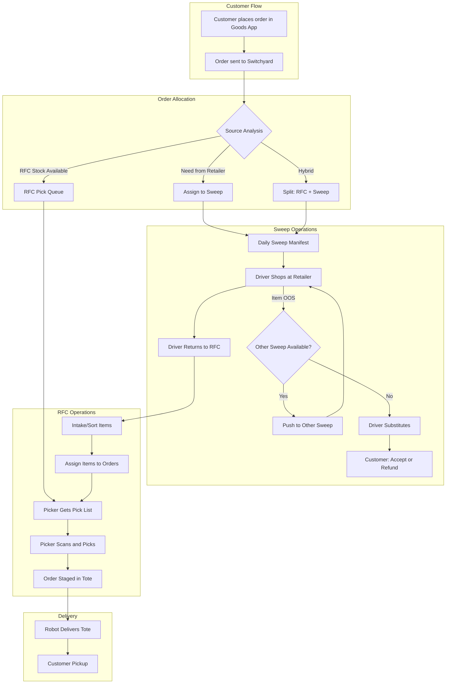

# Order Flow

This document describes the complete lifecycle of an order in the Goods/Switchyard system, from customer placement through robot delivery.

## Overview

Orders in Goods can be fulfilled from two sources:

1. **RFC (Warehouse)** - Items stocked in our fulfillment center, available for immediate picking
2. **Retailers** - Items sourced from partner retailers (HEB, Target, Walmart, Central Market, Whole Foods, Costco, Trader Joes)

The fulfillment strategy depends on product availability, pricing, and route optimization.

## Order Flow Diagram

## Order Statuses

| Status | Description |
|--------|-------------|
| `pending` | Order just placed, awaiting processing |
| `processing` | Being allocated to sweeps and/or RFC pick queue |
| `sweep_in_progress` | Driver is shopping at retailer(s) |
| `intake` | Items returned to RFC, being sorted |
| `picking` | RFC items being picked by warehouse staff |
| `staged` | Order assembled in tote, ready for robot |
| `delivering` | Robot en route to customer |
| `delivered` | Customer has received order |

## Detailed Flow

### 1. Order Placement

Customer places an order through the Goods mobile app. The app handles:
- Product browsing and selection
- Cart management
- Payment processing (Stripe)
- Delivery window selection

The order is then sent to Switchyard via API.

### 2. Source Analysis

When an order arrives, the system analyzes each line item to determine sourcing:

**Decision Factors:**
- RFC inventory availability
- Retailer pricing (we track costs at each retailer)
- Retailer availability
- Route optimization (consolidate items to minimize trips)

**Sourcing Rules:**
- If item is in RFC stock → add to RFC pick queue
- If item needs retailer sourcing → assign to appropriate sweep
- If item available at multiple retailers → choose based on price and route efficiency

### 3. RFC-Only Orders

Orders containing only RFC-stocked items can be fulfilled within 10 minutes:

1. Order enters RFC pick queue
2. Picker receives pick list on Zebra scanner
3. Scanner app guides picker through efficient warehouse route
4. Items picked and scanned
5. Order staged in tote with QR code

### 4. Sweep Operations

Orders requiring retailer items follow the sweep process:

**Daily Sweeps:**
- One scheduled sweep per retailer per day
- Cutoff time determines which orders are included
- Additional sweeps can be added manually for high-volume days

**Sweep Manifest:**
- Aggregates ALL items needed from a retailer across ALL orders
- Not per-order picking - batch shopping trip
- Driver receives manifest on their device

**During Shopping:**
- Driver shops the manifest
- If item is out of stock:
  - Check if another sweep (different retailer) hasn't left yet
  - If yes, dynamically push item to that sweep
  - If no, driver substitutes and system notifies customer
- Customer can accept substitute or request refund

### 5. Intake Processing

When drivers return from sweeps:

1. Items scanned at intake station
2. System matches items to orders
3. Items sorted and staged for order assembly
4. Any sweep items + RFC items combined per order

### 6. Order Picking

Pickers use Zebra scanners with the picking app:

1. Picker assigned to order(s)
2. App generates optimized pick path through warehouse
3. Picker scans each item as picked
4. Validates correct item via UPC
5. Places items in order tote

### 7. Staging

Completed orders are staged in totes:

- Each tote has a QR code
- QR links tote to order
- Totes placed in staging area for robot pickup

### 8. Robot Delivery

Robot system (out of Switchyard scope):

1. Robot scans tote QR
2. Robot delivers tote to customer location (~100 feet)
3. Customer picks up order
4. Order marked as delivered

## Fulfillment Types

| Type | Items From | Fulfillment Time |
|------|------------|------------------|
| RFC-Only | Warehouse stock | ~10 minutes |
| Sweep-Only | Retailer(s) | Next available pickup window |
| Hybrid | RFC + Retailer(s) | Next available pickup window |

## Key Entities

| Entity | Purpose |
|--------|---------|
| Order | Customer order with line items |
| Sweep | Daily shopping trip to a retailer |
| SweepItem | Item on a sweep manifest |
| PickList | RFC picking assignment |
| PickListItem | Item to pick from warehouse |
| Driver | Person performing sweeps |
| Tote | Container for staged order |

## Integration Points

| System | Integration |
|--------|-------------|
| Goods Mobile App | Places orders via Switchyard API |
| Zebra Scanners | Use Scanner API for picking operations |
| Robot System | Reads tote QR codes (out of scope) |
| Customer Notifications | Webhooks from Switchyard to app |

## Future Considerations

- Third-party delivery options (robots still stage orders)
- Multiple pickup/delivery locations
- Real-time inventory sync with retailers
- Predictive stocking based on order patterns
