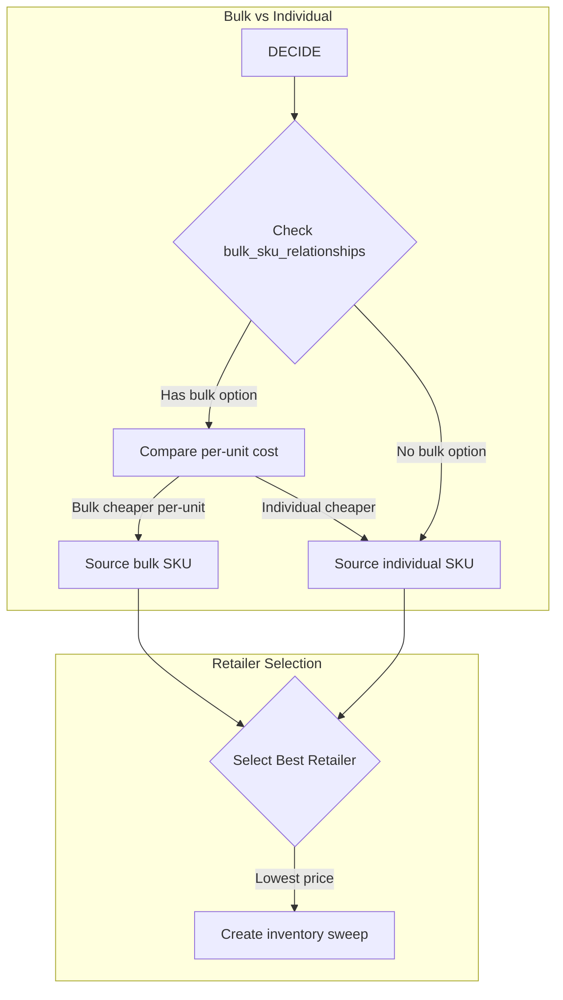

# Inventory Management

Switchyard provides a hierarchical inventory location system with FEFO/FIFO picking support, designed for warehouse and retail operations.

## Location Hierarchy

Inventory locations follow a 5-level hierarchy:

```
Zone > Aisle > Bay > Shelf > Slot
```

| Level | Description | Example |
|-------|-------------|---------|
| **Zone** | Major area of the warehouse | `A` (Ambient), `C` (Chilled), `F` (Frozen) |
| **Aisle** | Numbered pathway | `1`, `2`, `3` |
| **Bay** | Section within an aisle | `1`, `2`, `3` |
| **Shelf** | Vertical position in bay | `1` (bottom) to `5` (top) |
| **Slot** | Horizontal position on shelf | `1` to `4` |

## Location Code Format

Location codes follow the pattern: `{Zone}{Aisle}-{Bay}-{Shelf}-{Slot}`

Examples:
- `A1-1-1-1` - Zone A (Ambient), Aisle 1, Bay 1, Shelf 1, Slot 1
- `F2-3-4-2` - Zone F (Frozen), Aisle 2, Bay 3, Shelf 4, Slot 2
- `C1-2-1-1` - Zone C (Chilled), Aisle 1, Bay 2, Shelf 1, Slot 1

## Inventory Items

The `inventory_items` table tracks physical inventory in the RFC warehouse with support for FEFO/FIFO picking.

### Key Fields

| Field | Description |
|-------|-------------|
| `sellable_product_id` | Reference to the sellable product |
| `location_id` | Physical location in warehouse |
| `quantity` | Total quantity in this item |
| `reserved_quantity` | Quantity reserved for orders |
| `received_at` | When received (for FIFO) |
| `expiration_date` | Expiration date (for FEFO, nullable) |
| `lot_number` | Lot tracking |
| `source_sweep_id` | Which sweep brought this in |
| `unit_cost` | Acquisition cost |

### FEFO/FIFO Picking

When picking inventory for orders, items are selected in this order:

1. **FEFO (First Expired, First Out)** - Items expiring soonest are picked first
2. **FIFO (First In, First Out)** - For non-perishables, oldest received items are picked first

```sql
-- Picking order
SELECT * FROM inventory_items
WHERE sellable_product_id = $1
  AND is_available = true
  AND quantity > reserved_quantity
ORDER BY 
    expiration_date ASC NULLS LAST,  -- FEFO: expiring soonest first
    received_at ASC                   -- FIFO: oldest received first
LIMIT 1;
```

<Note>
Items without an expiration date (non-perishables) are picked last among items with the same received date.
</Note>

## API Endpoints

### Lookup by Barcode

```bash
GET /scanner/inventory/lookup?barcode=012345678901
```

Response:

```json
{
  "success": true,
  "barcode": "012345678901",
  "product": {
    "id": "550e8400-e29b-41d4-a716-446655440000",
    "name": "Organic Bananas",
    "brand": "Dole",
    "selling_price": 1.99,
    "is_perishable": true,
    "warehouse_zone": "C"
  },
  "inventory": {
    "total_quantity": 48,
    "total_reserved": 12,
    "available_quantity": 36,
    "items": [
      {
        "id": "inv-item-uuid",
        "location_id": "loc-uuid",
        "quantity": 24,
        "reserved_quantity": 6,
        "available": 18,
        "expiration_date": "2025-01-15",
        "received_at": "2024-12-15T10:00:00Z",
        "lot_number": "LOT-2024-001"
      }
    ]
  }
}
```

### Process Inventory Scan

```bash
POST /scanner/inventory/scan
Content-Type: application/json

{
  "barcode": "012345678901",
  "location_id": "loc-uuid",
  "quantity": 24,
  "action": "receive",
  "expiration_date": "2025-01-15",
  "lot_number": "LOT-2024-001"
}
```

Actions:

| Action | Description |
|--------|-------------|
| `lookup` | Just look up product and inventory |
| `adjust` | Add or subtract from current quantity |
| `count` | Set exact count (inventory audit) |
| `receive` | Receive new inventory (e.g., from sweep) |

### Receive Response

```json
{
  "success": true,
  "barcode": "012345678901",
  "action": "receive",
  "product": {
    "id": "prod-uuid",
    "name": "Organic Bananas",
    "is_perishable": true
  },
  "inventory": {
    "item_id": "new-inv-item-uuid",
    "quantity": 24,
    "reserved_quantity": 0,
    "available": 24,
    "location_id": "loc-uuid",
    "expiration_date": "2025-01-15"
  },
  "totals": {
    "total_quantity": 48,
    "total_reserved": 12,
    "available": 36
  },
  "scanned_at": "2024-12-18T15:30:00Z",
  "scanned_by": "staff-uuid"
}
```

## Inventory Replenishment

When inventory falls below reorder points, the system can automatically create inventory sweeps.

### Sourcing Decision

The system compares individual vs bulk pricing:

1. Check if a bulk SKU relationship exists
2. Compare per-unit cost for individual vs bulk
3. Select the best retailer based on price



## List Inventory Groups

```bash
GET /admin/inventory-groups
```

Query parameters:
- `type` - Filter by level type (zone, aisle, bay, shelf, slot)
- `parent_group_id` - Filter by parent location

## Permissions Required

| Action | Permission |
|--------|------------|
| View inventory | `inventory.read` |
| Update quantities | `inventory.write` |
| Scan operations | `inventory.scan` |
| Receive inventory | `inventory.receive` |
| Manage locations | `inventory.locations` |
