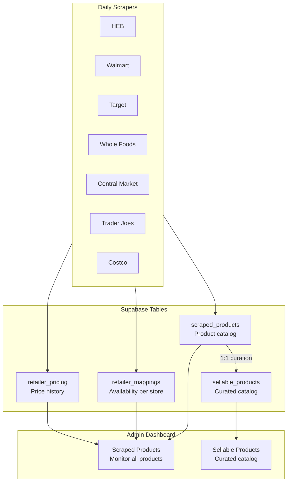

# Scraping & Product Data

Switchyard scrapes product data from 7 retailers daily. This guide explains the data flow, architecture, and how to use the Scraped Products dashboard.

## Supported Retailers

| Retailer | Scraper | Store ID Format |
|----------|---------|-----------------|
| HEB | `heb_scraper.py` | `heb-{store_number}` |
| Walmart | `walmart_scraper.py` | `walmart-{store_number}` |
| Target | `target_scraper.py` | `target-{store_number}` |
| Costco | `costco_scraper.py` | `costco-{warehouse_number}` |
| Whole Foods | `whole_foods_scraper.py` | `whole_foods-{store_id}` |
| Central Market | `central_market_scraper.py` | `central_market-{store_id}` |
| Trader Joe's | `trader_joes_scraper.py` | `trader_joes-{store_id}` |

## Data Flow



## What Scrapers Collect

### Product Data (scraped_products)

On first discovery of a new barcode, scrapers create a product record:

- **name** - Product name from retailer
- **barcode** - UPC/EAN (canonical identifier, unique)
- **brand** - Brand name
- **image_url** - Primary product image
- **category_id** - Mapped to Goods taxonomy
- **description** - Product description

<Note>
Scraped products are unique by barcode (UPC). The same product from multiple retailers maps to a single scraped_products record.
</Note>

### Availability Data (retailer_mappings)

Updated on every scrape run:

- **store_name** - Which retailer (heb, walmart, etc.)
- **retailer_location_id** - Specific store ID
- **store_item_id** - Retailer's internal SKU
- **store_location_text** - Aisle location (e.g., "Aisle 27")
- **store_aisle** - Parsed aisle number
- **is_active** - Currently available at this store
- **last_seen_at** - Timestamp of last successful scrape

### Pricing Data (retailer_pricing)

New record inserted when price changes - **this is our acquisition cost**:

- **price** - Effective price (what we pay)
- **list_price** - Regular price
- **sale_price** - Sale price (if on sale)
- **is_on_sale** - Currently on sale flag
- **price_per_unit** - Unit pricing (e.g., $0.25/oz)
- **effective_from** - When this price started
- **effective_to** - When this price ended (null = current)

### Retailer Selling Prices (retailer_selling_prices)

What retailers charge their customers - used for competitive analysis:

- **selling_price** - Retailer's customer-facing price
- **store_name** - Which retailer
- **updated_at** - When last updated

<Note>
**Three Price Types:**
- `retailer_pricing.price` = Our cost (what we pay retailers)
- `retailer_selling_prices.selling_price` = Retailer's customer price
- `sellable_products.selling_price` = Our customer price
</Note>

## Write Separation

Scrapers have limited write access to protect data integrity:

| Table | Scraper Permissions |
|-------|---------------------|
| `scraped_products` | **Create** new products only. Cannot update existing core attributes. |
| `retailer_mappings` | **Full control** - upsert availability and location on every run |
| `retailer_pricing` | **Insert only** - new price records, never update/delete |
| `sellable_products` | **No access** - admin-only curation decisions |
| `inventory_items` | **No access** - admin-only RFC stock management |

<Warning>
Once a product is curated and added to the sellable catalog, scrapers cannot accidentally modify its core attributes. Scrapers only update retailer-specific tables (pricing, availability).
</Warning>

## Scraped Products Dashboard

The admin dashboard includes a **Scraped Products** page for monitoring all scraped data.

### List View

Displays all 114K+ products with:

- Product image and name
- Barcode (UPC)
- Category
- Number of retailers carrying the product
- Lowest current price across retailers
- Last seen timestamp (data freshness)
- Whether product is already sellable

### Detail View

Shows a single product with:

**Retailer Comparison Table:**

| Retailer | Price | Sale | Unit Price | Aisle | Available | Last Seen |
|----------|-------|------|------------|-------|-----------|-----------|
| HEB | $4.99 | - | $0.31/oz | A12 | Yes | 2 hrs ago |
| Walmart | $4.47 | $3.97 | $0.25/oz | A5 | Yes | 1 hr ago |
| Target | $5.29 | - | $0.33/oz | B23 | No | 3 days ago |

**Price History Chart:**

Line chart showing price trends over time for each retailer.

## Running Scrapers

Scrapers can be run from the admin dashboard or via CLI.

### From Admin Dashboard

1. Navigate to **Scrapers** in the sidebar
2. Select a retailer and store
3. Click **Run**

### From CLI

```bash
# Run a single retailer
python -m scrapers.heb_scraper --store-id 92

# Run all scrapers
python -m scrapers.run_all

# Dry run (no database writes)
python -m scrapers.heb_scraper --dry-run
```

## Data Freshness

Scrapers update `last_seen_at` on every successful run. The dashboard shows freshness indicators:

| Status | Meaning |
|--------|---------|
| **Fresh** | Seen within 24 hours |
| **Recent** | Seen within 7 days |
| **Stale** | Not seen for 7+ days |

Products not seen for 4+ consecutive days are automatically marked with `is_active = false` and `deactivation_reason = 'DISCONTINUED'`.

## Category Mapping

Scrapers map retailer-specific categories to the Goods taxonomy:

```python
# Example: HEB category mapping
"Dairy & Eggs" → "dairy"
"Dairy & Eggs > Milk" → "dairy/milk"
"Produce > Fresh Fruits > Berries" → "produce/fruit/berries"
```

The `category_mapping.py` module handles this translation for each retailer.

## Troubleshooting

### Product not appearing

1. Check if barcode is valid (6+ characters)
2. Verify scraper completed successfully
3. Check `retailer_mappings` for the product/store combo

### Price not updating

1. New prices are inserted, not updated
2. Check `effective_to IS NULL` filter for current prices
3. Verify the scraper is writing to correct store ID

### Missing aisle location

Not all retailers provide aisle information. Check `store_location_text` and `store_aisle` fields:
- HEB: Usually available
- Walmart: Available via store-specific API
- Target: Available via store-specific API
- Others: May be limited or unavailable

### Product not in sellable catalog

Scraped products must be curated to become sellable:
1. Check if `sellable_products` record exists for the scraped product
2. Admin must create sellable_products entry with pricing
3. Use the Sellable Products page to curate
